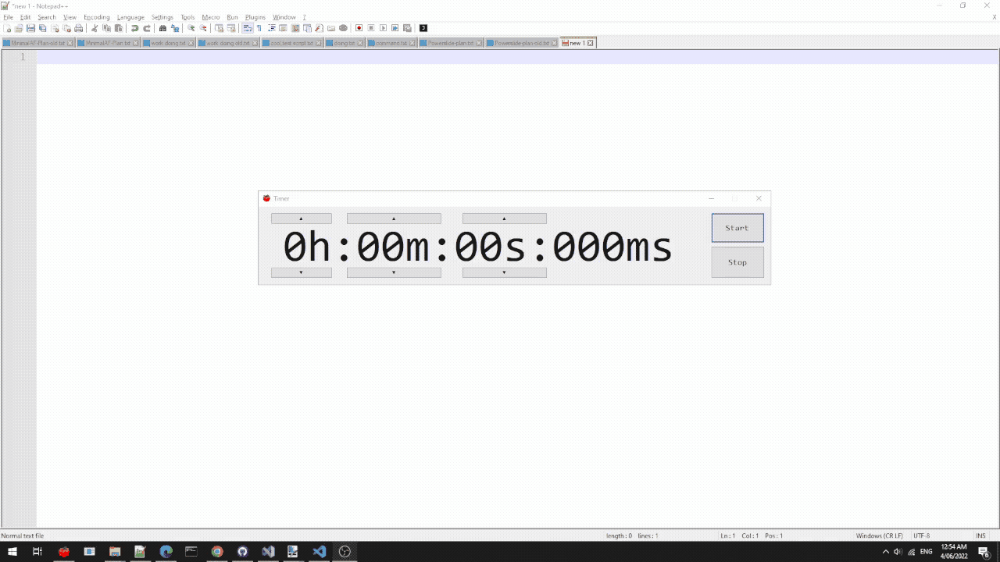

# Problem statement
I have an hourglass timer on my phone. But the ringing hurts my ears, gives me tinnitus, and makes everyone within 1km's ears bleed. Ok maybe not the last part. But it isn't very pleasant. Not to mention that it is startling, but this would also apply to any other timer that uses a loud sound as the mechanism for telling you that the time is up.

And every sound you could possibly use will either be un-noticeable, or annoying after a while.

## Non-grating timer

This is a win-forms program that will become one of those "always on top" windows once the countdown ends. It will also be bouncing around the screen like one of those DVD icons on those old TVs untill you click on it, so you are sure to notice it.

The UI can look better, but I refuse to spend any more than a few hours on this project.

To use, build the program using C# and Visual Studio 2022. Or just download the binary from the release section.

~~TODO: make this thing travel accross multiple monitor~~ Done
